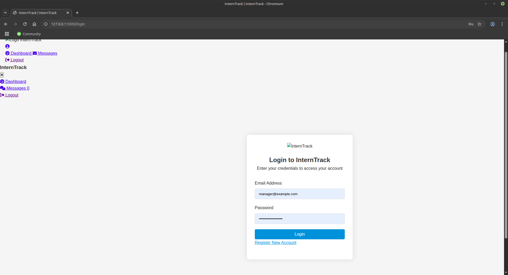
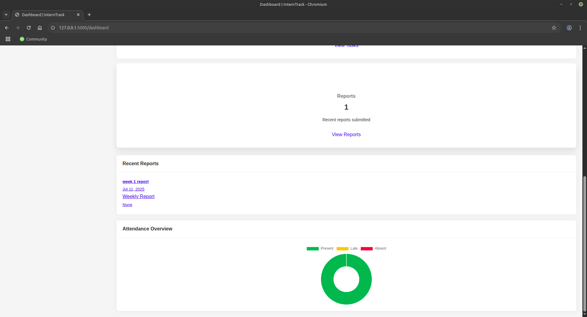

# Intern Tracker

Intern Tracker is a web-based internship management system built with **Flask** and **SQLite**. It is currently **under active development**.

---

## 🚀 Features (In Progress)
- Intern, Supervisor, Manager, and Admin roles
- Attendance tracking
- Report submission & review
- Messaging system
- Task assignment and monitoring
- Secure authentication and role-based access
---

## 📸 Screenshots

### 🔐 Login Page


### 📊 Dashboard



## ⚙️ Installation & Setup (Development)

1. **Clone the repository:**
```bash
git clone https://github.com/Agentyin/intern-track.git
cd intern-track
python3 -m venv myenv
source myenv/bin/activate
pip install -r requirements.txt
flask shell
>>> from app import db
>>> db.create_all()
>>> exit()

 - run the create admin python code
flask run


DON'T FORGET TO TURN ON THE VIRTUAL ENVIRONMENT
